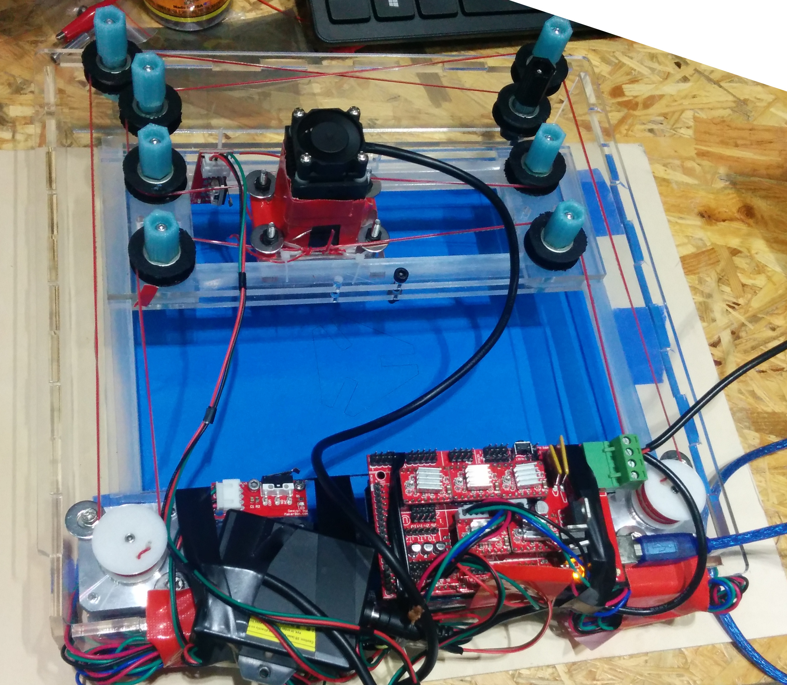
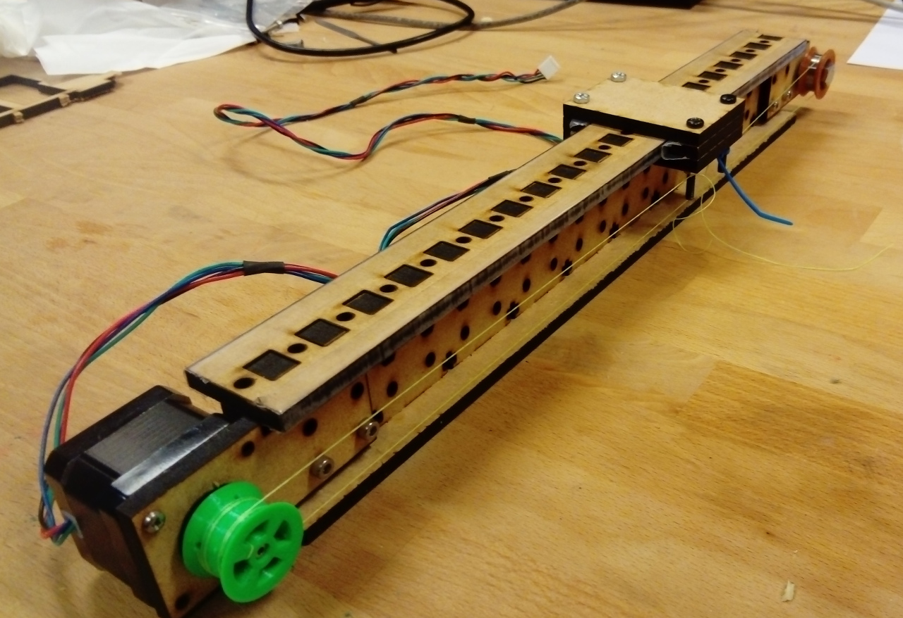
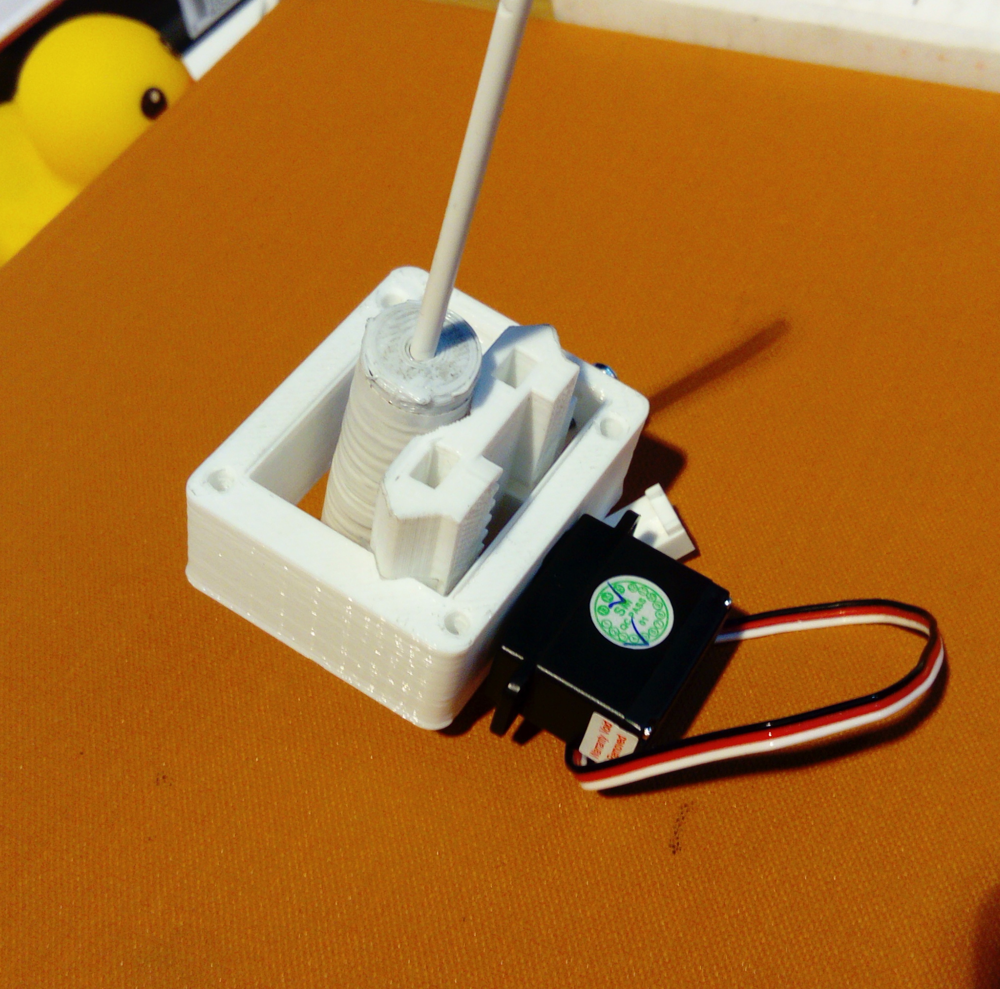

# TapeXY

Experiment in super low-cost XY stage, for uses in digital fabrication techniques
which have minimal weight and forces on head (laser engraving, 3d-printing).
Inspired by the [RishaLaser](http://rishalaser.org) project.

[Youtube VIDEO](https://www.youtube.com/watch?v=Eynk2ZyVWqM)

Key features:

* Using low-friction tape as basis for gliding surfaces,
inspired by [a design](http://www.thingiverse.com/thing:3554) by Peter Jansen
* Using braided Nylon/Polyamid wire ("Spectra line") instead of timing belts.
Like on Tantillus and some Delta printers.
* Reproduction with primarily lasercutter (or CNC mill), in wood/acrylics.
* [CoreXY](http://corexy.com) kinematics

### Parts

Fabricated

* Frame [FreeCAD](./tapexy-frame.fcstd)
* Gantry [FreeCAD](./tapexy-gantry.fcstd)
* Head [FreeCAD](./tapexy-head.fcstd)
* Pulleys. NinjaFlex/SemiFlex for friction. [FreeCAD](./pulley-ninjaflex.fcstd)
* Idlers. 2x [sideguides](http://www.thingiverse.com/thing:31216) for 608 bearing

Assembly: [FreeCAD](./tapexy.fcstd)

Main vitamins

* MDF/Plywood/Acrylic 3-6 mm.
* 2x NEMA17 stepper motors.
* 1x Motion driver board. RAMPS or similar
* Cables for motors and endstops
* Low-friction tape, width at least 20mm. Recommened:
[UHMWPE 1in 3mil](https://www.amazon.com/JVCC-UHMW-PE-3-UHMW-Polyethylene-Film/dp/B00WUU61AQ) |
Alternative: Kapton tape, as used for Reprap 3d-printers.
* Strong line. Recommended: Braided fishing line (Spectra or similar).
Alternative: Nylon, Polyester or linen.
* 2x Endstops.

Misc vitamins

* 8x 608 bearings, for idlers.
* 8x M8x40 bolts, for idlers.
* 8x M3x10 bolts, for stepper.
* 4x M4x25 bolts, for head/gantry.

Effector

* 1x Laser diode module including driver.

## Done

* First working prototype of XY stage, driven by RAMPS/Cura
* [Laser diode driver](../currentsource). Linear constant-current source based on op-amp+MOSFET, for 5volt supply.
* Fully operational prototype, driven by RAMPS w/Marlin

### TODO

v2 implement improvements

* Ensure lasermodule does not interfere with wire/belt path
* Make the pulley have holes for fixing the wire onto, and semi-hollow core for easy threading
* Make the pulleys smaller
* Add holes in backwall for motor cables
* Add mounting holes for endstops
* Design a belt/line attachment and tensioning system. Or just use strip-ties??
* Reduce touchpoints/area for the gantry slides.
* Add holes for attaching RAMPS/controlboard
* Use a full mid-plate in the gantry for stiffness
* Maybe move the walls inwards, closer to the slide surface area

Next, full-size laser test

* Make fully parametric, driven by material size + work area
* Use 2x as the standard workarea aspect ratio
* Use a standard diode laser module (or something compatible). 33mm sink seems common.
* Find a solution for managing the cables going to head/effector. 4mm ID bowden tube? PP or even paper folded into tube

Reproducability

* Test using multiple fiber-guided IR laser diodes with focusing mirror, to cut 4mm+ acrylic.
* Test making axis in multiple parts, so one can make machines as big as area
* Test replacing the 608 bearings with printed+tape bearings
* Test cutting the low-friction tape with diode laser
* Reduce number of screws used. Use lasercut pins instead?

Maybe:

* Design some self-adjusting system for friction parts
* Make a vinylknife/pen attachment
* Prototype a matching Z-bed/table design
* Test FDM printing

Research

* Coefficient of friction.
[Table](http://www.goodfellow.com/catalogue/GFCat2C.php?ewd_token=Q4ZIFOAVRhE2dSOYkbUxPMdSBZyxXk&n=Ab6sV0qHM8iAeitFJGlgDA1qjQCrhQ&ewd_urlNo=GFCat26&type=30&prop=3)
Kapton/Polyimide: 0.45, Teflon/PTFE: 0.05-0.2, UHMW PE: 0.1-0.2. UHMW apparently has the best abrasion resistance, seems somewhat cheaper than PTFE.

Existing low-cost laser diode engravers

* [smartDIYs](http://www.thingiverse.com/thing:1026345) open source kit. Lasercut acrylic, steelrods+timingbelts, motor on gantry.
* [Mr. Beam](https://www.mr-beam.org/) open source kit. Kickstarter 2014. 3d-printed + wood-frame. [Octoprint-based](https://github.com/mrbeam/OctoPrint) software
* [Emblaser](https://darklylabs.com/emblaser-overview) [2](https://sites.google.com/site/3dprinterlist/lasercutters/darklylabs-a3-diode-laser)
* [Fabool Laser Mini](http://www.smartdiys.cc/fabool-laser-mini/) claims to be openn source. Also has a CO2 laser available.

## I-beam

Designed to be a basic construction module, from which relatively large multi-axis machines can be made.

[v1 on Thingiverse](http://www.thingiverse.com/thing:1850612).
[v1 demo video](https://www.youtube.com/watch?v=oqJivOp4JyQ)

Features

* Rigid I-beam structure, with double-layer core for rotational stiffness
* Trapped nuts allows attaching from all sides
* Use as linear guide for slider by wrapping low-friction tape

Source files for FreeCAD

* [Beam](./ibeam2t.fcstd)
* [Slider](./ibeam2t-slider.fcstd)
* [Motor connection](./ibeam2t-motor.fcstd)

Vitamins needed:

* Low-friction tape. UHMW PE or Teflon ideal. Kapton also works OK
* NEMA17 stepper motor, incl M3 screws
* Braided line (fishing line or similar)
* 4 pieces M4x20+
* 4 pieces M4x15+

### TODO

Beam

* Improve trapped nut pattern in sides. Top-left and bottom-right (diagonal) should face one side
* Remove redundant (blind) holes in top/bottom layer
* Make tabs wider, reduce number by approx half
* Split up cut parts into multiple, with top/bottom/sides being a staggered/lapped
* Maybe reduce height/width a little bit. 30x40 mm?

Tests

* Test making axis in multiple parts, with total length 1.5-2x than machine working area.
* Test in 3-4 mm plywood. Faster to make and possibly self-replicatable. Is it rigid enough?
* Design & test a CoreXY using the I-beam as basic building block

Other designs for lasercut beams (untested)

* I-beam. [FreeCAD source](./ibeam-20.fcstd)
* II-beam. [FreeCAD source](./ibeam-30.fcstd)

Tools for calculating stiffness of beams

* http://www.had2know.com/technology/I-beam-calculator-moments-engineering.html
* http://www.engineersedge.com/section_properties_menu.shtml
* http://www.amesweb.info/SectionalPropertiesTabs/SectionalPropertiesIbeam.aspx
* https://en.m.wikipedia.org/wiki/Deflection_(engineering)
* https://en.m.wikipedia.org/wiki/List_of_second_moments_of_area

## Pen Z-axis

3d-printed files [on Thingiverse](http://www.thingiverse.com/thing:1850720).
[FreeCAD source project](./tapepen.fcstd).

Using a printed V-rail geometry, covered with low-friction tape.
Has adjustment for the tension, was very practical to dial in the correct amount.

Fits pens 8-15 mm in diameter.
Lifts straight up, perpendicular to surface. Roughly 10 mm travel.
Unlike many others servo-driven pen axes which rotate when lifting pen. 

Used in the penplotter which was the award given to the winners of Oslo Innovation Award 2016.
Successfully printed the diploma live on stage.

Vitamins needed:

* Microservo. SG92R or other with same size head, https://www.adafruit.com/product/169
* Low-friction tape. UHMW PE or Teflon ideal. Kapton can be used as replacement
* 2x M3x30 + M3 hex nuts for attaching pen to slider
* 2x M3x30 for adjusting tension on the slider

TODO/improvements

* Use a slightly bigger/stronger servomotor
* Use as basis for a lens-moving Z axis for lasers.
Probably use 3 v-rails instead of 2, keep tensioning principle.

Existing designs by others

* Servo+fishingline, spring in one direction. http://www.thingiverse.com/thing:749118
* Servo with 2-bar linkage, lasercut. http://www.thingiverse.com/thing:4185
* Servo with PTFE bushing, spring in down direction. http://www.thingiverse.com/thing:13407
* Servo with rotating slot linkage, lasercut+3dprint. http://fab.cba.mit.edu/classes/863.14/people/nathan_melenbrink/Week_15.html
* Servo with steel bars and POM bushing parts. CNCed https://www.tindie.com/products/ijinstruments/servo-actuated-pen-slide/
* XY pan+tilt mover, with Z motion. http://www.thingiverse.com/thing:31463

## Reproducability

### Power needed to reproduce itself.

Mr.Beam II says that with 5W they can cut 4 mm plywood in two passes (no focus adjustment).
It seems to be a blue diode laser with no air assist. This probably sets 5W as the a lower limit.

* Adding air-assist might improve cutting efficiency a bit.
* Adjusting the focus into the material for each pass might help
* Using PWM to overdrive the laser periodically may also help

If one could cut 4 mm acrylic instead, or 5-6 mm plywood, that would make it simpler to make a more rigid machine.
This _might_ be doable with 8-10 watts IR diode. If more is needed, may need to assemble 15-20 watt using multiple diodes.

### Construction tricks

To make more reproducible

* Use I/H beam or similar structures to achieve stiffness
* Use 2x 2-3mm material instead of 1x 4-6mm, sandwiched using interlocking geometry.

General best practices

* Use same bearings and screws types everywhere

Self-reproducability.

* Need to create structure bigger than own working area.
Let I/II-beams consist of multiple sections, with staggered joints?
Do testing of a long beam (50 cm+). Flatness, stiffness, maximum load.
Keep compatible with alu profiles? T-slot/Makerbeam/Openbeam

## Laser diodes

* [Banggood](http://www.banggood.com/Wholesale-Laser-Equipment-c-3491.html), 1.6W - [5.5W](http://www.banggood.com/445nm-5_5W-5500mW-Blue-Laser-Module-With-Heatsink-For-DIY-Laser-Cutter-Engraver-p-999283.html)
* Osram PL TB450B [DigiKey](http://www.digikey.com/product-detail/en/osram-opto-semiconductors-inc/PL%20TB450B/PL%20TB450B-ND/5719266)
* [DTR's Laser Shop](https://sites.google.com/site/dtrlpf/home/diodes)
* [Laserdirect@Ebay](http://www.ebay.com/sch/laserdirect/m.html?_nkw&_armrs=1&_ipg&_from&rt=nc&_mPrRngCbx=1)

Fibre guided

* [Ebay: 8 watt NIR 980nm](http://www.ebay.com/itm/980nm-8W-Fiber-Coupled-Laser-Semiconductor-Fiber-Coupled-laser-8000mW-IR-Laser-/141524214275?hash=item20f3802203:g:jsMAAOSwMpZUolDB)
* Ebay: [3W](http://www.ebay.com/itm/Laser-Diode-3-1-Watt-923nm-Fiber-Coupled-100um-JDSU-6380-L2-3-1W-NEW-63-00123-/111598682682?hash=item19fbccc23a:g:mhMAAOSwPhdU3sXA)
and [5W](http://www.ebay.com/itm/Laser-Diode-5-Watt-915nm-Fiber-Coupled-100um-JDSU-6390-L3-5W-NEW-63-00192-/111598671030?hash=item19fbcc94b6:g:0M8AAOSwqu9U3r8Y)

Should be possible to [combine](https://www.rp-photonics.com/beam_combining.html) multiple such fibre laser diodes with one focusing lens (maybe with colliminator).
To achieve powers of N times the individual laser source. Though with simple combinators, the brightness will not increase so much, due to widening of beam size.
 Also the heatsink no longer needs to be on the head, reducing weight of moving parts.

## CO2 lasers

For cheap lasercutters, CO2 lasers are used.

There are several aspects which are challenging.

* Laser tube itself
* Cooling the gas
* The optics
* Power supply

Principle

Using gas mixture of helium, nitrogen, and carbon dioxide gas.
A common standard mixture is 4.5 percent CO2, 13.5 percent N2, and 82 percent He. Penn suggests using a mixture of 14:14:72 in narrow-bore CO2 laser.

Aactive cooling to keep the temperature of the discharge tube below around 30 degrees C or so.

Flowing-gas lasers

"the flowing-gas CO2 laser requires a vacuum pump to achieve the low pressures (10-30 torr or so)"

* [35 Watt Flowing Gas CO2 Laser Tube Kit](http://repairfaq.cis.upenn.edu/sam/rconway/35wtkit.pdf), assembly instructions.
* [Flowing gas CO2 laser conversion from sealed gas](https://www.photonlexicon.com/forums/showthread.php/17719-Flowing-gas-CO2-laser-conversion-from-sealed-gas)
* [First Homemade CO2 Laser Built From Scratch](http://jarrodkinsey.org/co2laser/co2laser.html)

References

* [Understanding CO2 laser](http://www.laserk.com/newsletters/whiteCO.html)
* [RP Photonics Encyclopedia: CO2 lasers](https://www.rp-photonics.com/co2_lasers.html), describes different types. Sealed tube versus
* [Homebrew CO2 Laser Design and Construction Notes](http://www.timefracture.org/laserdocs/laser_design_notes.html)
* [RepairFAQ: Home-Built Carbon Dioxide (CO2) Laser](http://www.repairfaq.org/sam/lasercc2.htm). Looots of information
* [RepairFAQ: Carbon Dioxide Lasers](http://www.repairfaq.org/sam/laserco2.htm). Loots of information

## Related projects...

Of mine

* [Clothing](../clothing), various techniques rely on laser
* [Rishalaser](../rishalaser), build of existing open-source low-powered laserengraver

Of others

* [MPlus One](http://www.thingiverse.com/thing:1104249).
Cantilevered, moving bed like PrinterBot Simple and Smartrap, with lasered/milled structure.
Maybe has potential in combination with tape principle, possibly making even cheaper than a CoreXY?

Possible addons

* [Lasercut vacuum table](http://hackaday.com/2016/03/19/diy-vacuum-table-makes-lasering-even-easier)
* [Air assist for diode laser](http://www.thingiverse.com/thing:1688209), 3d-printed using a radial fan
* [Air assist for compressor](http://www.thingiverse.com/thing:72691).
Seems a small oil-free compressor (airbrush etc) is good enough. Recommened ratings are 30-50 PSI at 1-2.5 CFM.

## TapeZ

Moving-bed Z-axis stage for laserengraver/3d-printer to go with TapeXY.
Also uses Kapton tape and braided Nylon wire.

Existing wire/belt Z-axis:

* [SmartRapCore alternative Z](http://www.thingiverse.com/thing:896556)
* [Sli3dr](http://richrap.blogspot.co.uk/2014/07/3d-printers-big-printers-small-printers.html)
* [Igentis](https://www.youmagine.com/designs/ingentis-a-tantillus-variant)
* [Printxel](http://printxel.blogspot.ca/2012/12/printxel-community.html)
* http://forums.reprap.org/read.php?177,310249
* http://forums.reprap.org/read.php?160,170024
* http://forums.reprap.org/read.php?177,192178
* http://forums.reprap.org/read.php?14,319321
* http://forums.reprap.org/read.php?279,188149

A challenge is that Z-resolution/precision might be a bit low without gearing.
The hold-torque of a NEMA17 stepper might also not be enough to keep bed up.
Reduction gearing of between 1/4 and 1/9 is desirable.

## TapeCrane

My dad wants to build a cheap, large-scale 3d-printer (workspace with sides of 50-100cm)
which could be stowed away when not in used. For this he had two ideas for the kinematics.
One being a robot arm with two joints (elbow and wrist), working in the XY plane. Like SCARA.
The arm up/down or the bed would move to form Z axis.
The effector is cantilevered, making it tricky to keep rigid, and there are multiple
solutions for the inverse kinematics and singularity points.

The other idea was more like a crane, a [cylindrical robot](https://www.google.no/search?q=cylindrical+robot&tbm=isch).
It has the advantages of much simpler inverse kinematics (because no articulated joints),
and that the structure can be made more rigid in various ways:
Using tensioned wires (like a guy-wire), by supporting the far end, and/or using a (moving) counterbalance.

The most common configuration, has a rotating base. Alternatively, one can rotate just the (elevated) arm.
Either the whole arm can move back & forth to move end-effector, or the effector can travel along a static arm.

Unlike a cartesian or delta robot, several cylindrial robots could work into the same workarea.
They could potentially collaborate on a single (large) part, either for speed or multi-filament.
Or indepentently making different parts, or multiple instances of the same part.

Challenges:

* Mimizing weight of rotating joint, keeping it close to center of axis. For maximum speed
* Implementing the IK for cylindrical in firmware
* Cylindrical sectioned build area
* Decreasing precision at long-reach

TODO:

* Sketch a rough concept
* Test an arm beam, with tensioned wires on top+bottom for ridigity

## Experiments

### Kapton 608 bearing

.. Wednesday 14 Oct 2015, Oslo ..

Attempted to create a 608-sized bearing/bushing. 3d-printed, using Kapton tape added afterwards.
Using a V-profile to make the bearing support some axial load.
Initially 120 deg, but had to increase to 135-degrees to make it possible to insert inner part into outer ring.
Tolerances when 3d-printed (on a Ultimaker Original) seemed generally OK.

However, major issues were found when trying to assemble.
The Kapton tape was not particularly sticky to the print,
and would not easily fold around the V-profiles, especially the outer ring (with inward V profile).
When pressing the inner part of the bearing in, would easily
move the carefully aligned tape... Avoiding folds/creases was quite tricky.

I was able to succesfully assemble one bearing, with tape only on the inner part.
This rotated quite nicely, with not too much play.
Considering the application of belt pulley, where some excentricity is quite OK.
Indicates that if one can figure out a practical assembly, the idea has some merit.

It could be that in larger scale, and with a more adhesive tape and, or with simpler geometry,
that the idea would have some merit. But with v-style 608 the process was too fiddly to be practical.

For TapeXY it could be possible to design an alternative idler/pulley solution.
For instance one could integrate the belt bottom/top guides, and use top/bottom of
rotating part for supporting the (tiny) axial load.

It is however desirable to be compatible with a standard solution,
or at least also allow a standard solution - since a hacked thing will (probably?)
never be as good as a proper bearing.

TODO

* Test cutting low-friction tape to revolved V-shape using laser.
If necessary, try to use additional glue. A jig for pressing the tape against when adhering could also help?
* Try an inverted design: inward V on inner part, outward V on outer ring.
This should be easier to adhere tape to, as the ring has shape towards the top/bottom, not hidden inside.
* Test using UHMW PE / PTFE tape.
* Design an integrated bearing+belt idler for CoreXY usage, compatible with 608-based

## References

Work by others

* [3d-printed bushing](http://www.thingiverse.com/thing:1196801), replaces speciality linear bearings
* [3d-printed beam surface](http://www.thingiverse.com/thing:9080/#comments)

